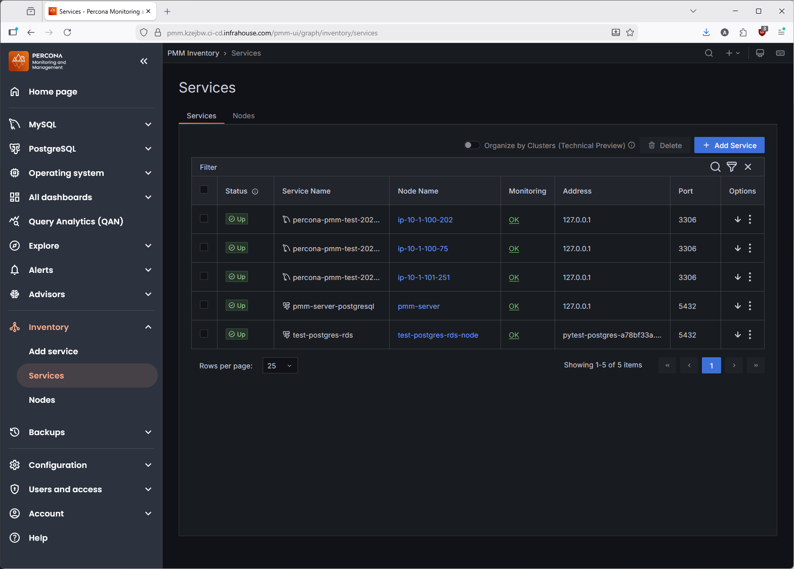
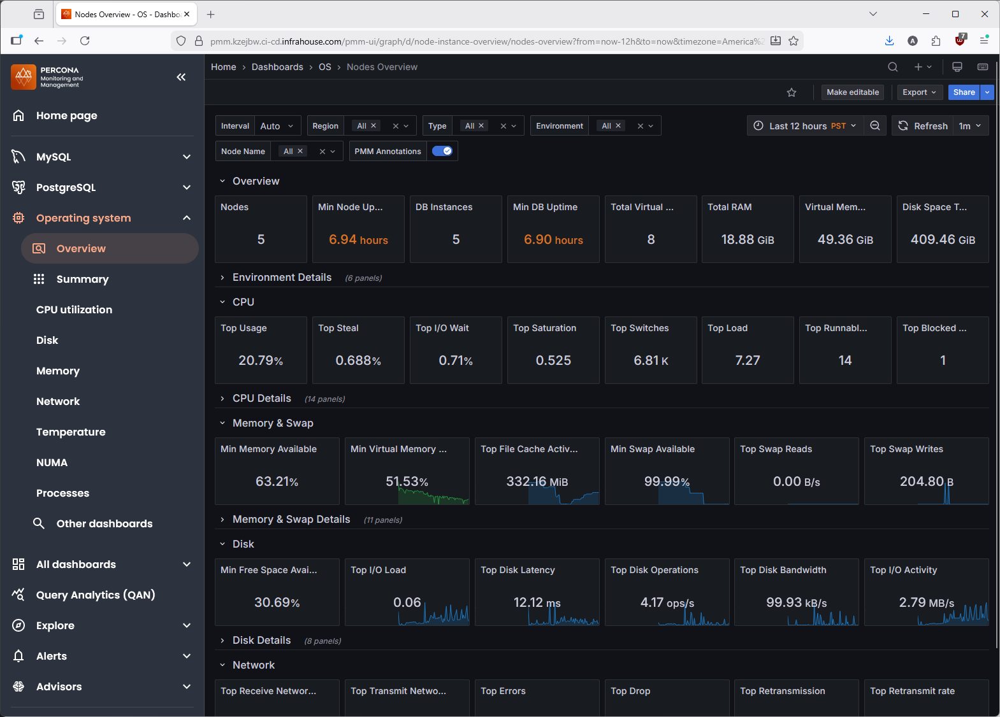
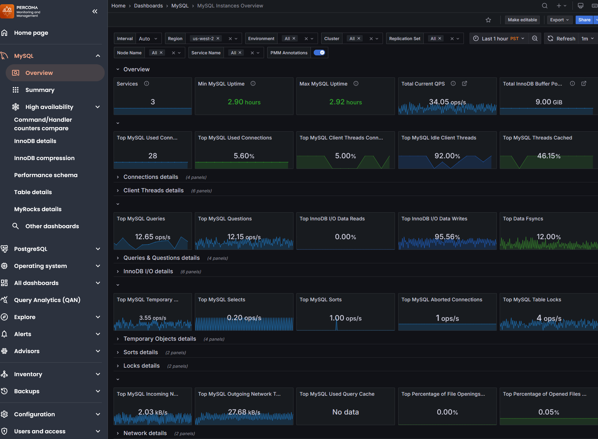
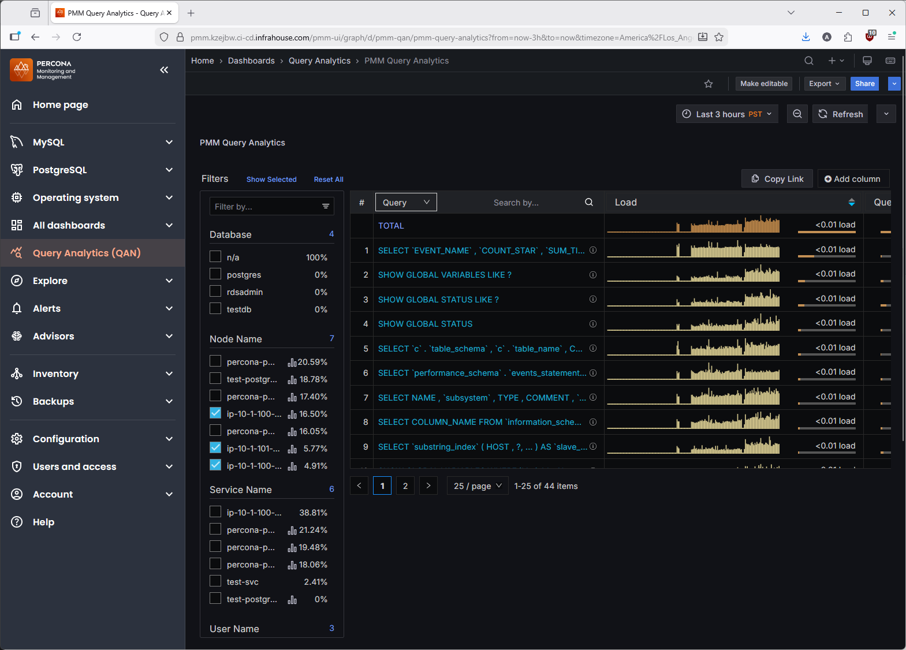

# Percona Server Monitoring Setup Guide

This guide explains how to configure PMM to monitor Percona Server instances
running in Auto Scaling Groups using the
[terraform-aws-percona-server](https://github.com/infrahouse/terraform-aws-percona-server)
module.

## Overview

Unlike RDS monitoring (which connects from PMM to the database), Percona
Server monitoring works by installing `pmm-client` on each ASG instance.
A Lambda function handles the lifecycle automatically:

- **New instances**: Lambda installs pmm-client via SSM, configures the PMM
  server connection, and adds MySQL monitoring
- **Terminated instances**: Lambda removes the service from PMM via API
- **Existing instances**: Lambda skips (the setup script is idempotent)

The Lambda runs every 5 minutes via EventBridge.

## Architecture

```
EventBridge (every 5 min)
    │
    └──> Lambda Reconciler
           │
           ├──> ASG API (discover instances)
           ├──> PMM HTTP API (list/remove services)
           └──> SSM RunShellScript (install pmm-client)
                  │
                  └──> Percona Server instances
                         │
                         └──> pmm-agent ──gRPC:443──> PMM EC2 (direct)
```

**Why direct connection?** pmm-agent uses gRPC (HTTP/2), which AWS ALB does
not support (returns HTTP 464). The agent connects directly to the PMM EC2
instance on port 443 using a self-signed certificate
(`--server-insecure-tls`).

## Prerequisites

- Percona Server ASG deployed with
  [terraform-aws-percona-server](https://github.com/infrahouse/terraform-aws-percona-server)
- ASG instances must be SSM-managed (SSM agent installed, IAM role with
  SSM permissions)
- `percona-release` pre-installed on instances (handled by Puppet in the
  Percona Server module)
- Instance credentials stored in Secrets Manager, accessible via
  `ih-secrets` and Puppet facts (`facter -p percona.credentials_secret`)
- Private subnets must have a NAT gateway (Lambda needs to reach AWS APIs)

## Step 1: Configure the PMM Module

```hcl
module "percona" {
  source  = "registry.infrahouse.com/infrahouse/percona-server/aws"
  version = "0.6.0"

  # ... Percona Server configuration ...
}

module "pmm" {
  source  = "registry.infrahouse.com/infrahouse/pmm-ecs/aws"
  version = "1.2.0"

  providers = {
    aws     = aws
    aws.dns = aws.dns
  }

  public_subnet_ids  = var.public_subnet_ids
  private_subnet_ids = var.private_subnet_ids
  zone_id            = var.zone_id
  environment        = var.environment
  alarm_emails       = var.alarm_emails

  monitored_asgs = [
    {
      asg_name          = module.percona.asg_name
      service_type      = "mysql"
      port              = 3306
      username          = "monitor"
      security_group_id = module.percona.security_group_id
    }
  ]
}
```

### What This Creates

When `monitored_asgs` is non-empty, the module creates:

| Resource | Purpose |
|----------|---------|
| Lambda function | Runs every 5 min, reconciles ASG instances with PMM |
| EventBridge rule | Triggers the Lambda on schedule |
| Lambda security group | Allows Lambda to reach PMM (port 80) and AWS APIs (port 443) |
| PMM ingress rule (port 80) | Allows Lambda to call PMM HTTP API |
| PMM ingress rule (port 443) | Allows pmm-agent gRPC from ASG instances |
| IAM policy | SSM, ASG, EC2, Secrets Manager permissions for Lambda |

### `monitored_asgs` Fields

| Field | Description |
|-------|-------------|
| `asg_name` | Name of the Auto Scaling Group (not ARN) |
| `service_type` | Database type (`"mysql"` currently supported) |
| `port` | Database port (e.g., `3306`) |
| `username` | Key in the credentials JSON for password lookup |
| `security_group_id` | SG of ASG instances (creates port 443 ingress to PMM) |

## Step 2: Apply and Verify

After `terraform apply`, the Lambda will run automatically within 5 minutes.
To invoke it immediately:

```bash
# Get the Lambda function name from Terraform output
FUNCTION_NAME=$(terraform output -raw reconciler_lambda_function_arn \
  | awk -F: '{print $NF}')

# Invoke manually
aws lambda invoke \
  --function-name $FUNCTION_NAME \
  output.json && cat output.json
```

Expected output:
```json
{"status": "ok", "added": 3, "removed": 0, "errors": []}
```

## Step 3: Verify on Instances

Connect to an ASG instance and check pmm-client:

```bash
aws ssm start-session --target <instance-id>

# Check connection status
sudo pmm-admin status

# Should show:
# Connected : true
# node_exporter    Running
# vmagent          Running
# mysqld_exporter  Running
```

## Step 4: Verify in PMM UI

Navigate to **Configuration** > **Inventory** > **Services**. You should see
services named `{asg_name}/{hostname}` for each ASG instance:



Each instance provides:

- **OS metrics**: CPU, memory, disk, network (via `node_exporter`)



- **MySQL metrics**: queries, connections, InnoDB, replication (via
  `mysqld_exporter`)



- **Query Analytics**: slow queries, query patterns (via `perfschema`)



## What the Lambda Installs

The Lambda runs an idempotent bash script on each instance via SSM:

1. **Install pmm-client** (if not present):
   `percona-release enable pmm3-client && apt-get install pmm-client`

2. **Configure PMM server** (if not connected):
   `pmm-admin config --server-insecure-tls --server-url='https://admin:<password>@<pmm-ip>'`

3. **Add MySQL monitoring** (if mysqld_exporter not running):
   `pmm-admin add mysql --username=<user> --password=<pass> --host=127.0.0.1 --port=<port>`

The script reads database credentials from the instance's own Puppet facts
and Secrets Manager (via `ih-secrets get`).

## Monitoring Multiple ASGs

You can monitor multiple Percona Server clusters:

```hcl
module "pmm" {
  # ...

  monitored_asgs = [
    {
      asg_name          = module.percona_prod.asg_name
      service_type      = "mysql"
      port              = 3306
      username          = "monitor"
      security_group_id = module.percona_prod.security_group_id
    },
    {
      asg_name          = module.percona_analytics.asg_name
      service_type      = "mysql"
      port              = 3306
      username          = "monitor"
      security_group_id = module.percona_analytics.security_group_id
    },
  ]
}
```

## Troubleshooting

### pmm-agent Connection Timeout

```
dial tcp 10.x.x.x:443: i/o timeout
```

**Cause**: Security group doesn't allow port 443 from ASG instances to PMM.

**Fix**: Verify `security_group_id` is correctly set in `monitored_asgs`.
The module creates the ingress rule automatically.

### "already exists" Error

```
pmm-admin add mysql: service already exists
```

**Cause**: Stale service from a previous instance with the same hostname.

**Fix**: The Lambda automatically removes the stale service via PMM API and
retries. If it persists, manually delete from PMM UI:
**Configuration** > **Inventory** > **Services** > delete the stale entry.

### Credentials Lookup Failure

```
facter: command not found
ih-secrets: command not found
```

**Cause**: PATH doesn't include `/opt/puppetlabs/bin` or `ih-secrets` is not
installed.

**Fix**: The Lambda script sets PATH explicitly. If the issue persists, verify
the instance was provisioned correctly by the Percona Server module.

### Lambda Timeout

**Cause**: First-time pmm-client installation takes ~60s per instance.
With many instances sequential, may exceed the 300s Lambda timeout.

**Fix**: The Lambda will catch up on the next invocation (5 minutes later)
since the script is idempotent.

## Additional Resources

- [PMM Documentation](https://docs.percona.com/percona-monitoring-and-management/)
- [terraform-aws-percona-server](https://github.com/infrahouse/terraform-aws-percona-server)
- [Architecture](ARCHITECTURE.md) -- detailed component and security design
- [Runbook](RUNBOOK.md) -- operational procedures for the Lambda reconciler
